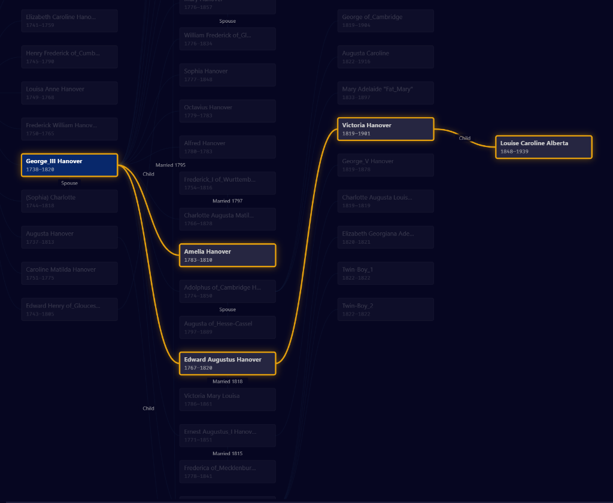
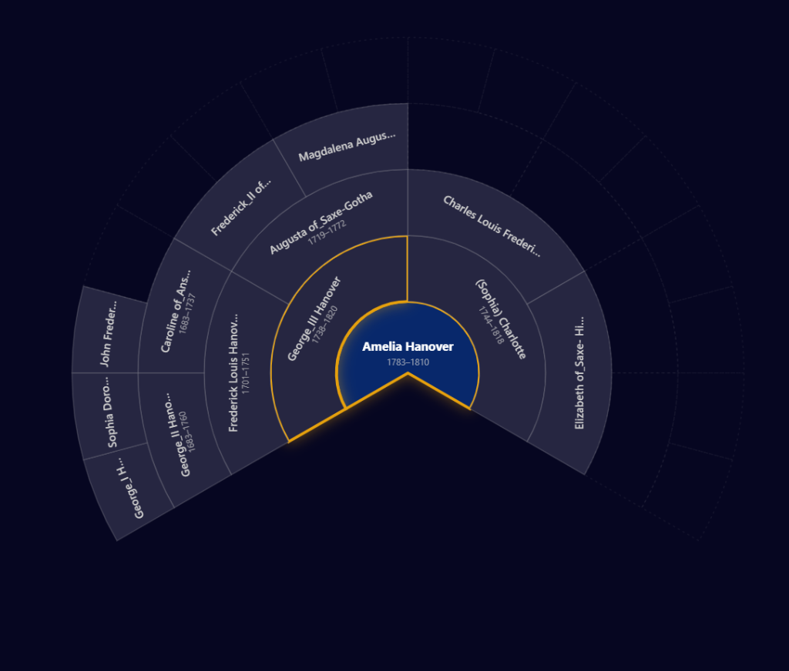
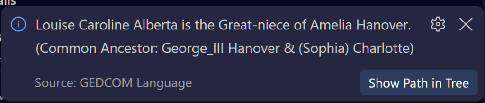
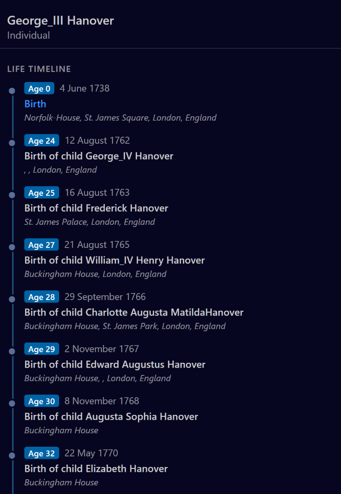

# vscode-gedcom

<p align="center">
  
</p>

<p align="center">
  <b>A comprehensive genealogical IDE for Visual Studio Code.</b><br />
  Interactive family trees, 5-generation circular fan charts, consanguinity & affinity relationship calculation, chronological life timelines, real-time plausibility diagnostics, and seamless GEDCOM 7 modernizer.
</p>

<p align="center">
  <a href="https://marketplace.visualstudio.com/items?itemName=florianguitton.vscode-gedcom"></a>
  <a href="https://marketplace.visualstudio.com/items?itemName=florianguitton.vscode-gedcom"></a>
  <a href="https://github.com/fguitton/vscode-gedcom/actions/workflows/ci.yml"></a>
  <a href="https://github.com/fguitton/vscode-gedcom/blob/master/LICENSE"></a>
</p>

---

GEDCOM files are historically dense with cryptic pointers, undocumented tags, and complex inter-record dependencies. **vscode-gedcom** turns raw genealogical data into an intuitive, visual workspace — complete with deep language intelligence, interactive graph visualizations, and strict verification against the FamilySearch GEDCOM specification.

> **GitHub Linguist Grammar:** This extension's grammar powers syntax highlighting for all `.ged` files across [github.com](https://github.com/github-linguist/linguist).

---

## 🌟 Visual Features & Tools

### 🌳 Interactive Family Tree & Kinship Path Highlighting

Draws dynamic generational trees directly in a dedicated side panel. Couples are linked by marriage unions, generations are automatically organized into columns, and children descend naturally from family bars.



- **Kinship Path Highlighting:** Finding a relationship traces and highlights the exact multi-generational line of descent with glowing golden branches, dimming unrelated relatives.
- **Directional Traversal:** Switch effortlessly between **Both Directions**, **Ancestors Only**, and **Descendants Only**.
- **Vector SVG Export:** Export any rendered branch into a standalone SVG with baked theme styles, solid background, and context-aware file naming (`tree-<xref>-<name>.svg`).
- **Interactive Controls:** Smooth pan, zoom-to-fit, recentering, and one-click code navigation back to any individual or family record.

---

### 🪭 5-Generation Circular Ancestor Fan Chart

Switch the tree view into a **$240^\circ$ Radial Fan Chart** to explore direct paternal and maternal lineages at a glance.



- **Ahnentafel Numbering:** Standardized genealogical indexing from the root person ($1$) through parents ($2, 3$), grandparents ($4\text{--}7$), and beyond.
- **Color-Coded Lineages:** Distinct visual styling for paternal and maternal branches with generation rings and empty-slot indicators.
- **Standalone Export:** Export the entire circular fan chart directly to clean vector SVG.

---

### 🧭 Relationship & Consanguinity Calculator

Select any two individuals in the file to instantly determine their exact genealogical connection.



- **Consanguinity (Blood) & Affinity (Marriage):** Accurately computes cousin degrees and removals (e.g. _2nd cousin once removed_), great-aunts/uncles, grand-nephews/nieces (niblings), in-laws, and step-relations.
- **Common Ancestor Resolution:** Identifies the nearest common ancestral couple or person connecting both individuals.
- **Show Path in Tree:** One click dynamically expands the family tree beyond default depth limits and frames the full path between the two relatives.

---

### ⏳ Chronological Life Event Timeline

Inspect a person's life journey in the **Details Panel** with an interactive vertical milestone timeline.



- **Computed Event Ages:** Displays exact computed age at every milestone (e.g., `Age 0` at birth, `Age 24` at marriage or birth of first child, `Age 81` at death).
- **Comprehensive Life Events:** Consolidates personal milestones (birth, baptism, residence, census, marriage, occupations, death, burial) and the births of children.
- **Click to Navigate:** Clicking any milestone jumps directly to the corresponding line in the editor.

---

## ⚡ Language Intelligence & Verification

### 🔍 Real-Time Diagnostics & Plausibility Validation

Driven by the official FamilySearch GEDCOM specification and registries:

- **Genealogical Plausibility Checks:** Identifies biological contradictions, including death before birth, implausible parent ages at child birth ($< 12$ or $> 70$), post-mortem births, marriage outside lifespan, and unrecorded deaths for individuals born $> 120$ years ago.
- **Syntax & Structural Validation:** Flags missing tags, invalid cardinality, unrecognized custom tags, and dangling or duplicate `@XREF@` pointers.
- **Version Awareness:** Automatically adapts validation rules for **GEDCOM 5.5.1**, **GEDCOM 5.5.5**, and **GEDCOM 7.0**.

---

### 💡 Automated Quick Fixes & Modernizer

- **Plausibility Quick Fixes:** Swap inverted birth and death dates or automatically insert missing `DEAT` entries.
- **Exporter Defect Repair:** Batch repairs broken lines that lost their level numbers due to known exporter quirks (such as MyHeritage note continuations).
- **One-Click GEDCOM 7 Upgrade:** `GEDCOM: Upgrade File to GEDCOM 7.0` updates headers, converts `CONC` to `CONT`, rewrites `RELA` to `ROLE`, collects custom `_TAG` extensions into a standard `HEAD.SCHMA` block, and ensures standard `0 TRLR`.

---

### 🏷️ Inlay Hints & Rich Hovers

- **Pointer Inline Names:** See who or what a pointer references directly in the editor line (`1 FAMS @F1@` $\rightarrow$ `John Smith + Jane Doe`).
- **Enumeration Decoders:** Translates opaque codes into plain English (`1 SEX M` $\rightarrow$ `Male`, `2 QUAY 3` $\rightarrow$ `Primary`).
- **Lifespan & Event Ages:** Shows subject age at event lines computed against their birth date (`died age 73`).
- **Smart Hovers:** Shows exact day-of-the-week for dates, clarifies approximate dates, verifies child counts against family records, and resolves place jurisdictions from `HEAD.PLAC.FORM`.

---

### ⌨️ Navigation, Formatting & Symbols

- **Workspace Symbol Search (`Ctrl+T` / `Cmd+T`):** Instantly search individuals by name or identifier, families by partner names, sources by title, and repositories.
- **Record Skeletons & Snippets:** Insert compliant boilerplate templates for `indi`, `fam`, `sour`, `repo`, `birt`, `marr`, `deat`, `buri`, `cens`, and `note`.
- **Document Formatting (`Shift+Alt+F`):** Normalizes level indentation, standardizes uppercase tag names, removes blank lines, and trims trailing whitespace.
- **Virtual Indentation:** Visually indents lines according to their level number without altering the underlying file content.

---

## 🛠️ Commands

| Command                   | Title                                             | Description                                                                   |
| :------------------------ | :------------------------------------------------ | :---------------------------------------------------------------------------- |
| `gedcom.findRelationship` | **GEDCOM: Find Relationship Between Individuals** | Computes kinship, common ancestors, and traces the relationship path.         |
| `gedcom.modernize`        | **GEDCOM: Upgrade File to GEDCOM 7.0**            | Automatically upgrades a GEDCOM 5.5.1 file to standard FamilySearch GEDCOM 7. |
| `gedcom.showGraph`        | **GEDCOM: Show Family Tree**                      | Reveals the interactive Family Tree & Fan Chart visualization panel.          |
| `gedcom.showDetails`      | **GEDCOM: Show Details**                          | Reveals the record inspector and chronological life event timeline.           |
| `gedcom.copyReport`       | **GEDCOM: Copy Diagnostics**                      | Copies sanitized environment diagnostics and server state to clipboard.       |
| `gedcom.showLog`          | **GEDCOM: Show Log**                              | Opens the live language server logging stream in the Output panel.            |

---

## ⚙️ Configuration Settings

| Setting                          | Default | Description                                                                                   |
| :------------------------------- | :------ | :-------------------------------------------------------------------------------------------- |
| `gedcom.graph.depth`             | `2`     | Number of generational hops displayed from the selected record.                               |
| `gedcom.graph.includeReferences` | `false` | Include citations, notes, and media records directly in the tree diagram.                     |
| `gedcom.validation.strictness`   | `auto`  | `auto` enforces strict rules on GEDCOM 7 and lenient on 5.5.x.                                |
| `gedcom.inlayHints.pointers`     | `true`  | Show resolved individual/family names at the end of pointer lines.                            |
| `gedcom.inlayHints.values`       | `true`  | Show plain-text descriptions for coded enumerations (`SEX`, `QUAY`, `PEDI`).                  |
| `gedcom.inlayHints.ages`         | `true`  | Show subject ages next to dated events based on their birth record.                           |
| `gedcom.codeLens.enabled`        | `true`  | Show record headers, relation summaries, and quick navigation links above records.            |
| `gedcom.details.imagePreviews`   | `true`  | Render thumbnail previews for remote `https` media URLs.                                      |
| `gedcom.virtualIndent.enabled`   | `false` | Visually indent lines in the editor based on GEDCOM level numbers without modifying the file. |
| `gedcom.virtualIndent.width`     | `2`     | Number of visual columns indented per level.                                                  |

---

## 📦 Installation

Search for **GEDCOM Language** in the VS Code Extensions view, or run:

```bash
ext install florianguitton.vscode-gedcom
```

Works seamlessly on desktop VS Code and in the browser on [vscode.dev](https://vscode.dev) and [github.dev](https://github.dev).

---

## 📜 Supported Standards

- **[FamilySearch GEDCOM 7](https://gedcom.io/specifications/FamilySearchGEDCOMv7.html)** (7.0.18, February 2025) — The active living standard with machine-readable registries.
- **[GEDCOM 5.5.5](https://www.gedcom.org/gedcom.html)** (2019) — UTF-8 strict maintenance specification.
- **[GEDCOM 5.5.1](https://www.gedcom.org/gedcom.html)** (1999) — The historic universal exchange standard.

---

## 🤝 Contributing & Feedback

Contributions, bug reports, and suggestions are warmly welcomed on [GitHub](https://github.com/fguitton/vscode-gedcom). Please refer to [CONTRIBUTING.md](https://github.com/fguitton/vscode-gedcom/blob/master/CONTRIBUTING.md) for development workflows.

Distributed under the [Apache-2.0 License](LICENSE).
